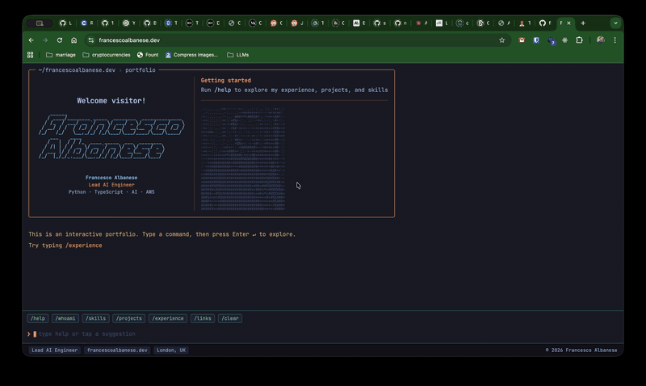
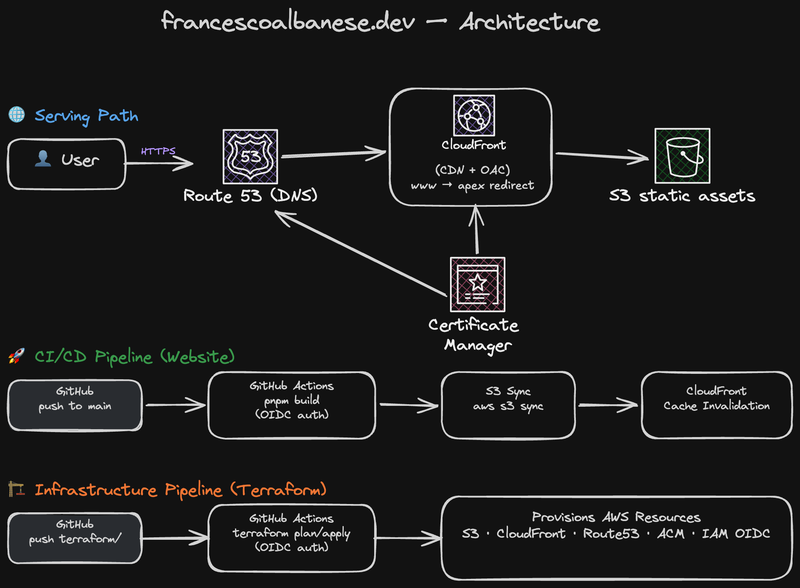

# francescoalbanese.dev

[](https://astro.build/)
[](https://react.dev/)
[](https://www.typescriptlang.org/)
[](https://tailwindcss.com/)
[](https://aws.amazon.com/cloudfront/)
[](https://web.dev/progressive-web-apps/)

Interactive terminal-based portfolio website. Type commands to explore skills, experience, and projects.

**[https://francescoalbanese.dev](https://francescoalbanese.dev)**

---

## Demo



---

## Features

- **Terminal interface** with command history, tab autocompletion, and streaming text output
- **Commands**: `/help`, `/whoami`, `/skills`, `/projects`, `/experience`, `/links`
- **ASCII art portrait** with interactive photo toggle (hover/tap)
- **Tokyo Night-inspired** dark theme with JetBrains Mono
- **Progressive Web App** with offline support and installable
- **Accessibility-first**: full `prefers-reduced-motion` support across all animations

---

## Tech Stack

| Category       | Technology                                                       |
| -------------- | ---------------------------------------------------------------- |
| Framework      | [Astro](https://astro.build/) 6 + [React](https://react.dev/) 19 |
| Language       | [TypeScript](https://www.typescriptlang.org/) 5.9 (strict)       |
| Styling        | [Tailwind CSS](https://tailwindcss.com/) 4                       |
| Testing        | [Vitest](https://vitest.dev/) + React Testing Library            |
| Linting        | [BiomeJS](https://biomejs.dev/)                                  |
| Infrastructure | AWS S3 + CloudFront + Route53 (Terraform)                        |
| CI/CD          | GitHub Actions with OIDC authentication                          |

---

## Architecture



- **CloudFront** handles TLS termination (ACM cert), caching (1-year for hashed assets, 5-min for HTML), and security headers (HSTS, X-Frame-Options)
- **Origin Access Control** ensures the S3 bucket is never publicly accessible

### CI/CD Pipeline

- **OIDC federation** for keyless AWS authentication (no long-lived credentials)
- Infrastructure managed via Terraform in a [separate repository](https://github.com/francescoalbanese/francescoalbanese-dev-infra)

## Local Development

```bash
pnpm install        # install dependencies
pnpm dev            # start dev server
pnpm build          # production build
pnpm preview        # preview production build
pnpm test           # run tests
pnpm check          # TypeScript type checking
```

## License

[MIT](LICENSE)
